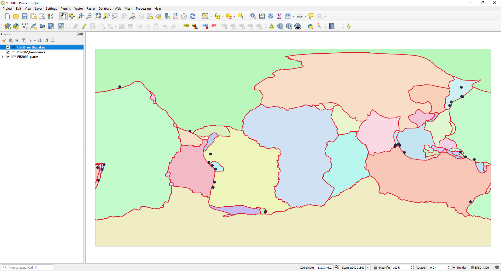

Exercise 1
==========

.. hint::

   Ziel der Übung
      * Die ersten Schritte wagen
      * Die Benutzeroberfläche verstehen und das Layer-Konzept kennenlernen
      * Vektor-Daten in einem GIS anzeigen und die Attributdaten einsehen 
      * Vektor-Daten umprojizieren (d.h. die Projektion der Daten ändern)

.. note::

   **Support findest du im Wiki**
      *  `Interface <https://courses.gistools.geog.uni-heidelberg.de/giscience/gis-einfuehrung/wikis/qgis-Interface>`__
      *  `Layer-Konzept <https://courses.gistools.geog.uni-heidelberg.de/giscience/gis-einfuehrung/wikis/qgis-Layer-Konzept>`__
      *  `Attributdaten <https://courses.gistools.geog.uni-heidelberg.de/giscience/gis-einfuehrung/wikis/qgis-Attributdaten>`__
      *  `Projektionen <https://courses.gistools.geog.uni-heidelberg.de/giscience/gis-einfuehrung/wikis/qgis-Projektionen>`__
.. seealso::

   Daten
      Lade dir die `Daten für die Exercise 1 herunter <https://drive.google.com/drive/folders/1xKB8gI3v29XL_NEvdtLZcm6ugaeuyl2L?usp=sharing>`__ und speichert
      sie auf eurem PC. Legt einen lokalen Ordner (nicht auf einem Netzlaufwerk wie zum Beispiel “Q://Abgabe”) an und speichert dort die obigen Daten (.zip Ordner müssen vorher entpackt werden).

      -  Erdbeben (Point) (Quelle: `United State Geological Suvey (USGS) <https://earthquake.usgs.gov/earthquakes/map/?extent=3.86425,-135.08789&extent=61.93895,-54.93164>`__)
      -  Plattengrenzen (Linie) (Quelle: `Hugo Ahlenius, Nordpil and Peter Bird basierend auf doi: 10.1029/2001GC000252 <https://github.com/fraxen/tectonicplates>`__)
      -  Platten (Polygon) (Quelle: `Hugo Ahlenius, Nordpil and Peter Bird basierend auf doi: 10.1029/2001GC000252 <https://github.com/fraxen/tectonicplates>`__)

.. important::

    Die Angabe der Quellen von denen du deine Geodaten beziehst ist für diesen Kurs erforderlich!

Aufgaben
--------

Ein QGIS-Projekt anlegen, Layer hinzufügen und speichern.

1. Öffne QGIS und mach dich mit der Nutzeroberfläche vertraut.
2. Öffne die oben angegebenen Dateien in QGIS. Ladet dazu die Vektor-Layer in euer Programm.
3. Interagiere mit der Karte und erkunde die Datensätze. Verwende hierfür das Zoom-Werkzeug und verschiebe die Karte. Beachte dabei die
   Statusleiste am unteren Bildschirmrand und wie diese sich verändert. Wie lauten die ungefähren Koordinaten für das Erdbeben in Alaska?
4. Mache dich mit dem Layer-Fenster (*Layer List*) vertraut. Blende abwechselnd verschiedene Layer ein und aus und verschiebe die Layer
   in der Hierarchie. Benennt den Layer *PB2002_plates* sinnvoll um. Beachte, dass letzteres keine Auswirkung auf die Datenquellen (Dateinamen, Speicherort) hat.
5. Schau dir die **Attributdaten der Layer** an. Schaue dir zu diesem Zweck die Attributtabelle an und mache dich mit der zugehörigen
   Nutzeroberfläche vertraut. a) Wie viele Features gibt es im Layer *PB2002_plates*? b) Welche Magnitude hatte das Erdbeben vor der Küste Neuseelands?
6. Ändere die **Projektion in der Kartenansicht** zu WGS84 / Pseudo-Mercator (EPSG-Code: 3857). **Beachte, dass dies nichts an der Projektion
   (den Koordinaten) der Dateien ändert.** Überprüfe dies in den Eigenschaften des Punkt-Layers. Welche Projektion ist dort angegeben?
7. Speichere nun den Plattengrenzen-Layer in der Projektion WGS84 / Pseudeo-Mercator. **Dies ändert die Projektion der Datei.** Überprüft dies in den Eigenschaften des neu erstellten Layers.
8. Speichere dein Projekt ab.

**So (oder ähnlich) sieht’s am Ende aus**

   Layer in QGIS zeigen Platten, Plattengrenzen & Erdbeben
