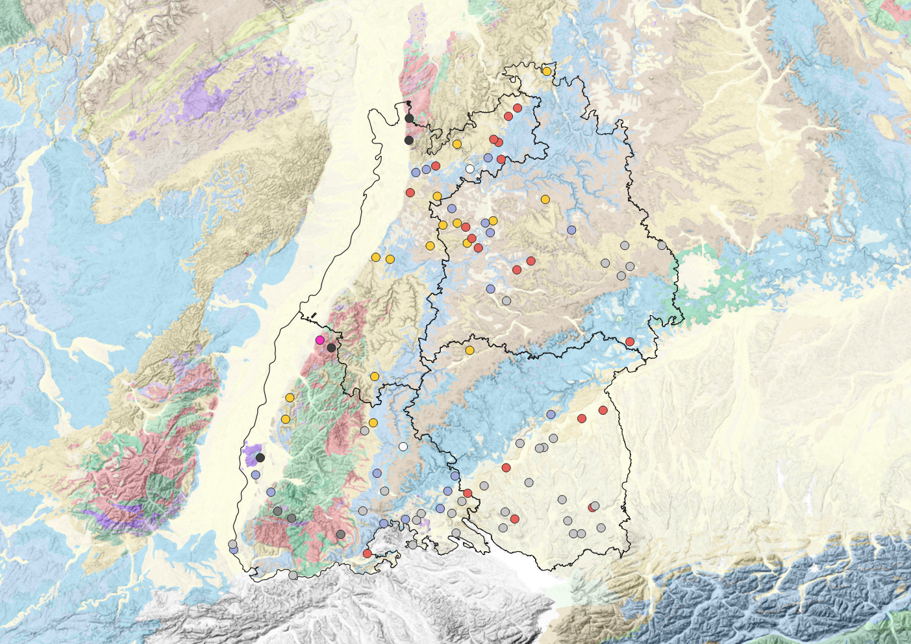

Exercise 2 - Optional
==========

Das ist eine freiwillige Zusatzaufgabe.

.. hint::

   Du bist früher fertig als angedacht? Dann versuche die obigen Geodaten selbstständig zu beschaffen und aufzubereiten. Ziel der Übung:
      * Einen WMS-Dienst hinzufügen

.. note::

   **Support findest du im Wiki**
      *  `WMS-Dienste <https://giscience.courses-pages.gistools.geog.uni-heidelberg.de/qgis-book//content/gis/01_karto-basics/home-Geodatenformate.html#web-map-service-wms>`__
   
.. seealso::

   Daten
      * `EGDI - WMS Surface Geologic Units Lithology <https://geoserver.geo-zs.si/egdi-surface-geology/gsmlp/wms>`__ (Quelle: `EGDI <https://www.geologicalservice.eu/upload/content/1529/egdi-factsheet-gseu_web_2024.pdf#:~:text=platform%20first%20created%20in%202016%20to%20provide%20free,and%20services%20from%20European%20National%20Geological%20Survey%20Organisations>`__)
      * `DLR - EOC Basemap Map Service <https://geoservice.dlr.de/eoc/basemap/wms>`__ (Quelle: `EGDI <https://geoservice.dlr.de/web/services>`__)

.. note::

   Web Map Services (WMS) erlauben es euch, Geodaten aus dem Web mit eurem GIS zu verknüpfen und abzurufen. 
   Als Ergebnis wird dir ein Kartenbild angezeigt. Diese WMS-Dienste stecken hinter den Basemaps. 
   Einen WMS-Layer kannst du hinzufügen, indem du im QGIS-Browser auf die Zeile **WMS/WMTS** ``Rechtsklickst`` > ``New connection...`` > ``Name: Kannst du vergeben; URL: https://geoservice.dlr.de/eoc/basemap/wms`` > ``OK``

   Weitere Informationen zu WMS finden sich auch unter: `OGC-Standards <https://www.ogc.org/standards/wms>`__.

Aufgabe
--------

1. Arbeite in deinem Projekt von Exercise 2 weiter (Nutze das Projektion WGS84 / Pseudo-Mercator - EPSG:3857)
2. Füge aus dem WMS-Dienstportfolio des **EGDI 1:1M Surface Geologic Units Lithology** Layers hinzu
3. Füge aus dem WMS-Dienstportfolio des DLR *EOC Basemap Map Server* den Layer **eudem_dem_3035_europe_hillshade** hinzu
4. Mache den EGDI-Layer etwas transparent. ``Rechtsklickst`` > ``Properties (Eigenschaften)`` > ``Transparency (Transparenz)`` > ``50%`` > ``OK``
4. Aktuallisiere dein Projekt im QGIS Print Composer
5. Exportiere deine Karte erneut als PDF

So (oder ähnlich) kann das Ergebnis aussehen
-------------------------------------

   Einfache Karte inkl. WMS-Layern.