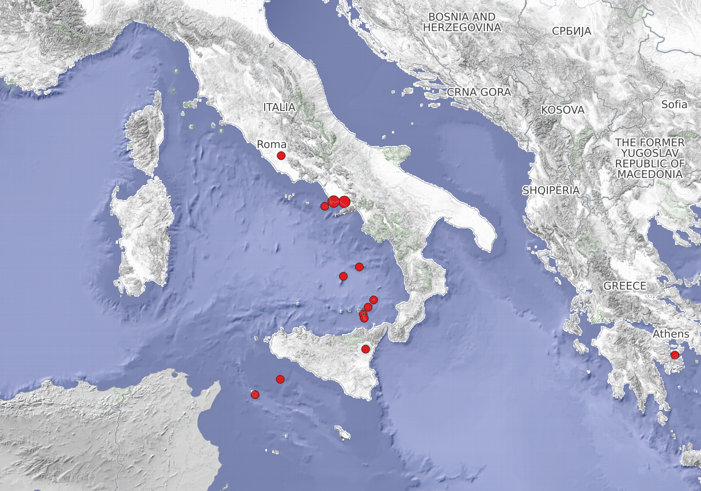

Exercise 3
==========

.. hint::

   Ziel der Übung
      * Nicht-räumliche Abfragen durchführen.
      * Räumliche Abfragen durchführen.
      * Geometrieoperationen nutzen (z.B. die Fläche eines Polygons berechnen).

.. note::

   **Support findest du im Wiki**
      *  `Projektionen <https://courses.gistools.geog.uni-heidelberg.de/giscience/gis-einfuehrung/wikis/qgis-Projektionen>`__
      *  `Nicht-Räumliche Abfragen <https://courses.gistools.geog.uni-heidelberg.de/giscience/gis-einfuehrung/wikis/qgis-Nicht-Räumliche-Abfragen>`__
      *  `Räumliche Abfragen <https://courses.gistools.geog.uni-heidelberg.de/giscience/gis-einfuehrung/wikis/qgis-Räumliche-Abfragen>`__
      *  `Geometrieoperationen <https://courses.gistools.geog.uni-heidelberg.de/giscience/gis-einfuehrung/wikis/qgis-Geometrieoperationen>`__

Daten
-----
In dieser Aufgabe lernt ihr neben der Selektion über Attribute auch verschiedene Wege der Geodatenbeschaffung kennen.
Dabei gibt es hier vier Wege:
   * der Download einer Excel Tabelle, die Koordinaten beinhaltet - Vulkane des Holozäns
   * der Download von Geodaten - Platten - & Plattengrenzen
   * der Import eines Web Mapping Services (WMS) - World Settlement Footprint
   * der Import eines Web Feature Services (WFS) - Vulkane des Holozäns

Lade dir die `Daten für die Exercise 3 herunter <https://drive.google.com/drive/folders/1xKB8gI3v29XL_NEvdtLZcm6ugaeuyl2L?usp=sharing>`__ und speichert
sie auf eurem PC. Legt einen lokalen Ordner (nicht auf einem Netzlaufwerk wie zum Beispiel “Q://Abgabe”) an und speichert dort die obigen Daten (.zip Ordner müssen vorher entpackt werden).

Beschaffe dir folgende Daten:
   * `Lade die XML Excel Datei hier <https://volcano.si.edu/volcanolist_holocene.cfm>`__ herunter
   * `Lade dir die Geodaten der Platten- & Plattengrenzen <https://github.com/fraxen/tectonicplates>`__ herunter

Quellen:
   *  Vulkane (Point) (Quelle: `Global Volcanism Program (2024): Volcanoes of the World (v. 5.2.5; 23 Dec 2024). Distributed by Smithsonian Institution, compiled by Venzke, E., DOI: https://doi.org/10.5479/si.GVP.VOTW5-2024.5.2. <https://volcano.si.edu/gvp_votw.cfm>`__)
   *  Platten- & Plattengrenzen (Linie) (Quelle: `Hugo Ahlenius, Nordpil and Peter Bird basierend auf doi: 10.1029/2001GC000252 <https://github.com/fraxen/tectonicplates>`__)
   *  World Admin 0 Countries (Polygon) (Quelle: `Natural Earth Data <https://www.naturalearthdata.com/downloads/110m-cultural-vectors/>`__)
   *  World Settlement Footrpint 2019 - DLR EOC (Raster) (Quelle: `Marconcini et al. (2021): Understanding Current Trends in Global Urbanisation - The World Settlement Footprint Suite, DOI: 10.1553/giscience2021_01_s33. <https://geoservice.dlr.de/web/datasets/wsf_2019>`__)

.. important::

    Die Angabe der Quellen, von denen du deine Geodaten beziehst, ist für diesen Kurs zwingend erforderlich!

Aufgaben
--------

1. Öffne die oben angegebenen Dateien in QGIS.
2. Wähle 3 Vulkane deiner Wahl (manuell) in der Benutzeroberfläche aus. Öffne nun die Attributtabelle und lass dir die Informationen für die
   ausgewählten Vulkane (Features) anzeigen. Speichere die ausgewählten Features anschließend in einer neuen Datei (Layer).
3. `Lies dir die Metadaten zur Bevölkerung durch <https://sedac.ciesin.columbia.edu/downloads/docs/gpw-v4/gpw-v4-documentation-rev11.pdf>`__ In welcher Einheit liegen die Bevölkerungszahlen vor?
4. Wähle nun anhand einer Abfrage (automatisch) alle Vulkane aus, die in ihrem 10km Radius mehr als 30.000 Einwohner beheimaten. Wie viele Vulkane
   gibt es, die diese Bedingung erfüllen? Welcher Vulkan hat die meisten Einwohner?
5. Führe nun eine kombinierte Abfrage durch. Selektiere zunächst alle Vulkane in Italien. Entferne anschließend Vulkane, deren letzte Eruption vor 1850 stattgefunden hat. Wie viele Vulkane gibt es in Italien, die seit 1850 aktiv waren? Wie viele Einwohner befinden sich dort?
6. Berechne die Fläche jedes einzelnen Features in Quadratmeter. (Bei Fragestellungen dieses Typs ist es besonders wichtig die Projektion
   der Daten zu beachten. Wir nutzen hier hier Mollweide (EPSG: 54009), eine flächentreue Projektion.) Welches ist das kleinste Land der Welt
   und wie groß (klein) ist es? Unter Land verstehen wir hier alle Features mit dem Status *Member State*.
6. Finde den Fehler. Im Pazifik scheint ein Vulkan besonders viel Bevölkerung innerhalb des 10km Radius zu beheimaten. Prüfe auf Plausibiltät!

   Layer in QGIS zeigen Platten, Plattengrenzen & Erdbeben

