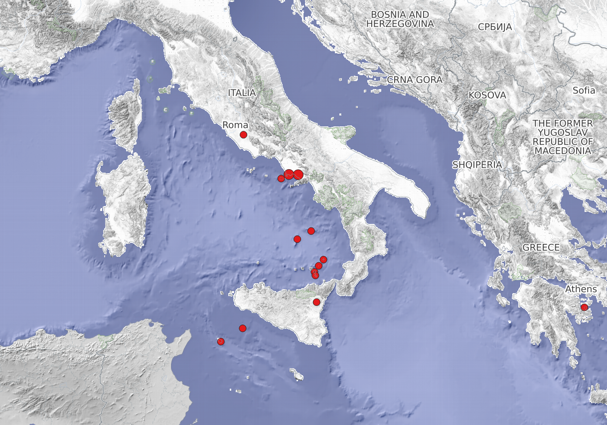

Exercise 3 - Optional
==========

Das ist eine freiwillige Zusatzaufgabe.

.. note::

    Du bist früher fertig als angedacht? Dann versuche die obigen Geodaten selbstständig zu beschaffen und aufzubereiten.

.. caution::
    Quellen
        * `WMS-Layer - World Settlement Footprint 2019 <https://webservices.volcano.si.edu/geoserver/GVP-VOTW/wfs?request=GetCapabilities>`__
        * `WFS-Layer - Vulkane <https://webservices.volcano.si.edu/geoserver/GVP-VOTW/wfs?request=GetCapabilities>`__

.. tip::

   **Support findest du im Wiki**
      * XML Dateien
      * Web Feature Layer - https://volcano.si.edu/database/webservices.cfm
      * `WMS-Layer <https://geoservice.dlr.de/eoc/land/wms?service=WMS&request=GetCapabilities>`__
      * `WFS-Layer <https://www.lgl-bw.de/export/sites/lgl/Produkte/Galerien/Dokumente/Kundeninformation_WFS_QGIS.pdf>`__

Beantworte folgende Fragen:
- Was sind WMS & WFS-Layer?
- Was ist der Unterschied zwischen einem WMS & einem WFS-Layer?
- Was sind die Vorteile eines WFS-Layers im Vergleich zu einer Excel-Tabelle?

.. tip::

    Nutze MS Copilot oder ChatGPT.

**Lade die Geodaten herunter & importiere diese in dein QGIS Projekt!**.

**So (oder ähnlich) kann es am Ende aussehen**

.. figure:: https://courses.gistools.geog.uni-heidelberg.de/giscience/kartographie_uebung/-/wikis/uploads/img/mac-about-window.jpg
   :alt: Beispielkarte der italienischen Vulkane nach `GVP <https://volcano.si.edu/volcanolist_holocene.cfm>`__ mit `WMS-Layern des DLR EOC <https://geoservice.dlr.de/web/datasets>`__

   Beispielkarte der italienischen Vulkane nach `GVP <https://volcano.si.edu/volcanolist_holocene.cfm>`__ mit `WMS-Layern des DLR EOC <https://geoservice.dlr.de/web/datasets>`__

